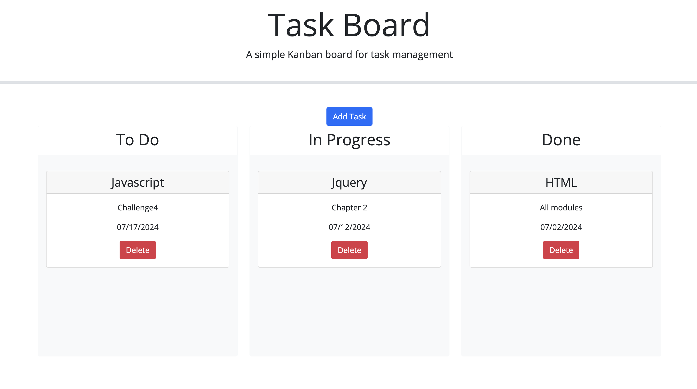

# Kanban-Board-Challenge5e
This is a kanban-board with classifications of TO-DO , INPROGRESS , DONE . A calender is also available

# Kanban-Board  📝

# Overview

The Task Board is a user-friendly Kanban board application designed to help you manage your tasks efficiently. Built using modern web technologies like HTML, CSS, JavaScript, and Bootstrap, this application provides a clean and intuitive interface for organizing tasks into different stages of completion: To Do, In Progress, and Done.

# File Structure

* index.html

* ./assets/script.js

* ./assets/style.js

* images

* Readme

# Features

* Add Tasks Easily: Quickly add new tasks using a modal form. Simply click the "Add Task" button, fill in the task details, and submit.

* Task Management: Organize your tasks into three categories: To Do, In Progress, and Done. Move tasks between categories by dragging and dropping.

* Responsive Design: The application is fully responsive and works seamlessly on all devices, from desktops to smartphones.

* Customizable: Easily customize the look and feel of the board by modifying the provided stylesheets and scripts.
Technologies Used

* HTML5: For structuring the application content.

* CSS3: For styling the application with Bootstrap for responsive design.

* JavaScript: For dynamic functionality and user interactions.

* Bootstrap: For responsive and modern UI components.

* jQuery: For DOM manipulation and event handling.

* Day.js: For date manipulation and formatting.

# Getting Started

To get started with the Task Board, simply download or clone the repository and open index.html in your web browser. No additional setup is required.

# Usage

* Click the "Add Task" button to open the task form modal.

* Fill in the task title, due date, and description.

* Submit the form to add the task to the "To Do" column.

* Drag and drop tasks between columns to update their status.

# screenshots 

* The Add Task pop up -  

* The Kanban-Board - 

